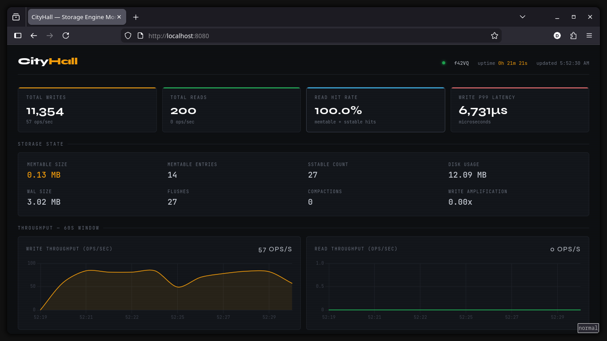

# CityHall 🏙️

A time-series storage engine built from scratch in Rust, using an LSM-tree architecture.
Built to understand the internals of databases like RocksDB, Cassandra, and InfluxDB.

[](https://www.rust-lang.org/)
[](https://github.com/ddhadho/cityhall)
[](https://github.com/ddhadho/cityhall)
[](LICENSE)

---

## Performance

| Optimisation | Metric | Result |
|---|---|---|
| **Bloom Filters** | Read latency (missing key) | **442x faster** (1,209μs → 2.74μs) |
| **Background Flush** | Write latency p99 | **93% lower** (100ms → 7ms) |
| **Compaction** | Space savings | **97.4%** |
| **WAL Batching** | Write throughput | **184,000 writes/sec** |
| **Prefix + Snappy** | Compression ratio | **~10:1** |

See [BENCHMARKS.md](BENCHMARKS.md) for methodology and raw results.

---

## Dashboard

CityHall ships with a live observability dashboard — time-series charts for throughput,
latency percentiles, MemTable size, SSTable count, and Bloom filter effectiveness.



A Prometheus-compatible `/metrics` scrape endpoint is also available on the same port:

```bash
curl http://localhost:8080/metrics
```

---

## Architecture

CityHall follows a classic LSM-tree design — optimise for write throughput, pay for it
on reads, then use Bloom filters and compaction to make reads fast again.

```
Write path:
  Client CLI → TCP daemon → WAL (batched, checksummed)
                          → Active MemTable (BTreeMap)
                          → [threshold] Immutable MemTable
                          → [background thread] SSTable (compressed, Bloom filter)

Read path:
  Client CLI → TCP daemon → Active MemTable
                          → Immutable MemTable
                          → SSTables newest→oldest
                              └─ Bloom filter check (skips disk I/O on miss)
```

For a full breakdown of every component, data flow, and design trade-offs:
**[Architecture Deep Dive →](ARCHITECTURE.md)**

---

## Features

**Durable writes** — every entry passes through a checksummed, batched WAL before
touching the MemTable. Crash recovery replays the WAL to rebuild in-memory state exactly.

**Non-blocking flush** — dual-MemTable architecture. When the active MemTable fills,
it is frozen and handed to a background thread. A fresh MemTable immediately accepts
writes, eliminating the p99 flush stall.

**Bloom filters** — custom implementation per SSTable. 1% false positive rate at 12KB
per filter. Missing key lookups skip all disk I/O.

**Size-tiered compaction** — k-way merge reclaims space and deduplicates keys across
SSTables. 97.4% space savings on write-heavy workloads with key overlap.

**Prefix compression + Snappy** — keys sharing a common prefix are delta-encoded within
each 16KB block before Snappy compression. ~10:1 compression ratio on sensor key patterns.

**Internal metrics** — atomic counters and reservoir-sampled histograms track writes,
reads, latency percentiles, flush/compaction events, Bloom filter effectiveness, and
disk usage. Exposed as JSON (`/api/metrics`) and Prometheus text (`/metrics`).

**systemd integration** — runs as a persistent background daemon with watchdog support.

---

## Getting Started

**Prerequisites**: Rust toolchain ([rustup.rs](https://rustup.rs))

```bash
git clone https://github.com/ddhadho/cityhall.git
cd cityhall
cargo build --release
```

Start the server:

```bash
./target/release/cityhall server
# ✓ WAL initialized
# ✓ StorageEngine initialized
# ✓ Dashboard started at http://localhost:8080/dashboard
# ✓ TCP server listening on 0.0.0.0:7878
```

Open **http://localhost:8080/dashboard** for the live metrics dashboard.

Write and read data:

```bash
./target/release/cityhall client put system.cpu.load "0.75"
# OK

./target/release/cityhall client get system.cpu.load
# VALUE 0.75

./target/release/cityhall client get does.not.exist
# NOT_FOUND
```

Check live metrics from the terminal:

```bash
./target/release/cityhall client metrics
# ━━━━━━━━━━━━━━━━━━━━━━━━━━━━━━━━━━━━
# 🏙️  CityHall Metrics  —  hostname
# ━━━━━━━━━━━━━━━━━━━━━━━━━━━━━━━━━━━━
# 📊 Operations
#    Writes:             1,000
#    Reads:                200  (hits: 200, misses: 0)
# ⚡ Latency
#    Write  p99:        818.0 us
#    Read   p99:        234.0 us
# ...
```

Scrape Prometheus metrics:

```bash
curl http://localhost:8080/metrics
```

> For running CityHall as a persistent systemd daemon, see [the systemd setup guide](cityhall.service).

---

## Tests

```bash
cargo test           # all tests
cargo test --release # with optimisations (accurate benchmark numbers)
```

Zero compiler warnings. All tests pass.

---

## Roadmap

- [ ] **Delete / tombstones** — correct deletion through WAL, MemTable, and compaction
- [ ] **Block cache** — LRU cache for decompressed SSTable blocks
- [ ] **Leveled compaction** — better read amplification for large datasets
- [x] **Metrics CLI command** — `cityhall client metrics` pretty-print
- [x] **Prometheus endpoint** — `/metrics` scrape endpoint
- [ ] **gRPC / HTTP API** — replace the current TCP protocol

---

## References

- [The Log-Structured Merge-Tree](https://www.cs.umb.edu/~poneil/lsmtree.pdf) — O'Neil et al., 1996
- [Bigtable](https://static.googleusercontent.com/media/research.google.com/en//archive/bigtable-osdi06.pdf) — Chang et al., 2006
- [LevelDB](https://github.com/google/leveldb) — Google's reference implementation
- *Designing Data-Intensive Applications* — Martin Kleppmann, Chapter 3
- *Database Internals* — Alex Petrov, Chapters 1–7

---

## License

MIT